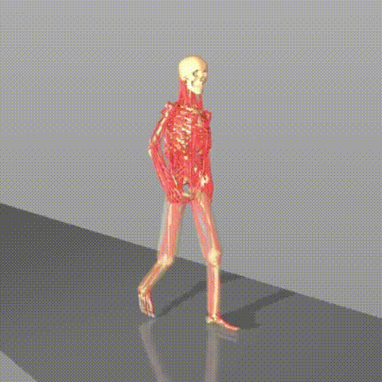
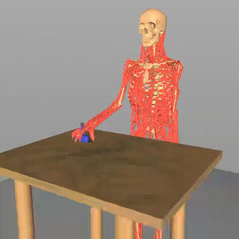
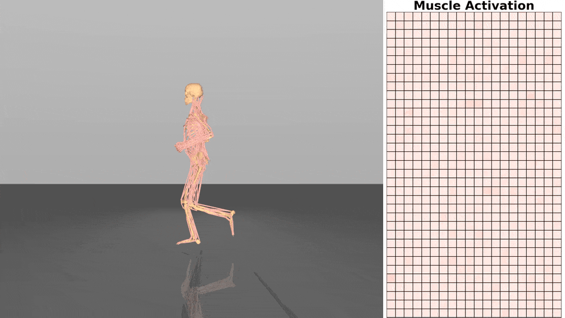
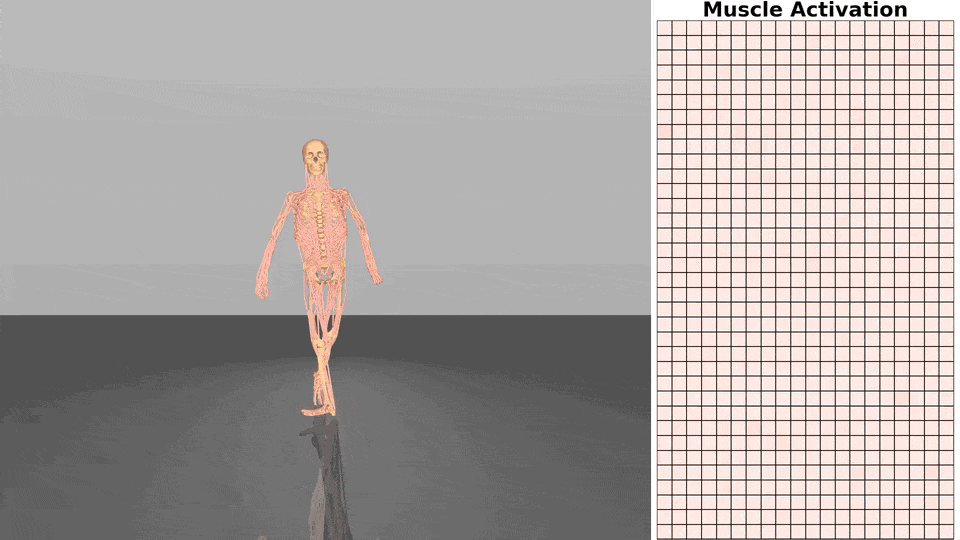

# msgym: Gymnasium Environments for MusculoSkeletal Models

[Gymnasium](https://gymnasium.farama.org/) environments for the **MS-Human-700** full-body human musculoskeletal model in [MuJoCo](https://mujoco.readthedocs.io/). This repository provides reinforcement learning–ready simulation environments for locomotion and manipulation tasks.

<p align="center">
  <a href="https://lnsgroup.cc/research/MS-Human">Project page</a> | <a href="https://github.com/LNSGroup/MS-Human-700">MS-Human-700 Model</a>
</p>

---

## Overview

MS-Human-700 is a full-body human musculoskeletal model with anatomically detailed body, joint, and muscle parameters. It includes 700 muscle–tendon units. For modeling and control details, see the [ICRA 2024 paper](https://arxiv.org/abs/2312.05473), [ICML 2024 paper](https://arxiv.org/abs/2407.11472), and [ICLR 2025 paper](https://arxiv.org/pdf/2505.08238).

This repository wraps MS-Human-700 as a Python package **msgym** so you can use it with `gymnasium.make()` after a standard install.

<div align="center">
  
  
</div>

<div align="center">
  
  
</div>

---

## Installation

### 1. Clone the repository with submodules

The MuJoCo model and assets live in the **MS-Human-700** submodule. Clone with recursion so it is included:

```bash
git clone https://github.com/LNSGroup/msgym.git --recursive 
cd msgym
```

If you already cloned without `--recursive`, initialize and update submodules:

```bash
git submodule update --init --recursive
```

### 2. Install the package

We recommend using [uv](https://github.com/astral-sh/uv) for fast dependency management (Python 3.12 by default):

```bash
uv python pin 3.12
uv sync
uv pip install -e .
```

After this, `import msgym` and `gymnasium.make("msgym/...")` work in your environment.

### Optional: DynSyn-SAC training

For DynSyn-SAC reinforcement learning training, install the optional dependency set:

```bash
uv sync --extra dynsyn
```

Then run training/evaluation directly from the repo root:

```bash
uv run python DynSyn-SAC/SB3-Scripts/train.py -f DynSyn-SAC/configs/locomotionFull.json
uv run python DynSyn-SAC/SB3-Scripts/eval.py -f DynSyn-SAC/logs/LocomotionFull -n 3
```

---

## Usage

Environments are registered with Gymnasium on `import msgym`. Use them as follows:

```python
import gymnasium as gym
import msgym

env = gym.make("msgym/LocomotionFullEnv-v1", render_mode="human", gait_cycles=5)
obs, info = env.reset()
# ... step, render
env.close()
```

**Registered environment IDs:**

| Environment ID                    | Description                          |
|-----------------------------------|--------------------------------------
| `msgym/LocomotionFullEnv-v1`      | Full-body locomotion imitation       |
| `msgym/LocomotionLegsEnv-v1`      | Legs-only locomotion imitation       |
| `msgym/ManipulationEnv-v1`         | Right-arm manipulation (reach/lift)   |

Run the test script from the repo root:

```bash
uv run python env_test.py
```

> **Headless / no display:**  
> 1. Use `render_mode="rgb_array"` (or omit rendering).  
> 2. For offscreen rendering, set `MUJOCO_GL=egl` (e.g. `export MUJOCO_GL=egl` or `$env:MUJOCO_GL="egl"` on Windows).

---

## Training (DynSyn-SAC)

Controllers can be trained with the DynSyn-SAC algorithm.

**Training:**

```bash
CUDA_VISIBLE_DEVICES=0 MUJOCO_GL=egl uv run python DynSyn-SAC/SB3-Scripts/train.py -f DynSyn-SAC/configs/locomotionFull.json
```

**Evaluation:**

```bash
CUDA_VISIBLE_DEVICES=0 MUJOCO_GL=egl uv run python DynSyn-SAC/SB3-Scripts/eval.py -f DynSyn-SAC/logs/LocomotionFull
```

Trained checkpoints are available from GitHub Releases.

---

## License

This project is released under the [Apache-2.0 License](LICENSE).

---

## Citation

If you use MS-Human-700 or msgym in academic work, please cite:

```bibtex
@inproceedings{zuo2024self,
  title={Self model for embodied intelligence: Modeling full-body human musculoskeletal system and locomotion control with hierarchical low-dimensional representation},
  author={Zuo, Chenhui and He, Kaibo and Shao, Jing and Sui, Yanan},
  booktitle={2024 IEEE International Conference on Robotics and Automation (ICRA)},
  pages={13062--13069},
  year={2024},
  organization={IEEE}
}
```

## Control Demo

<div align="center">
  
  
</div>
